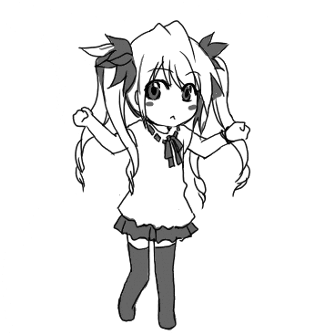

<!-- Banner -->

  

<h1 align="center">Hello! ~ 👋 I'm [Htet Zaw Phyo]</h1>

  

  

## 🖤 About Me

  
  

🧑‍💻 **Name:** Htet Zaw Phyo
💼 **Role:** Full Stack Developer  
🎮 **Hobbies:** Coding ・ Anime ・ Gaming ・ Coffee  
🎬 **Fav Anime:** One Piece ・ Haikyuu ・ Violet Evergarden ・ AOT  
🧠 **Quote:**  
<em>“In the code we trust. In the bugs we debug.”</em>

---

## 💻 Skills & Tools

  

---

## 💌 Contact Me

  
  

---

  

<em>Thanks for stopping by! May your code be clean, your bugs be minimal, and your anime marathons endless! 💻🎬</em>

